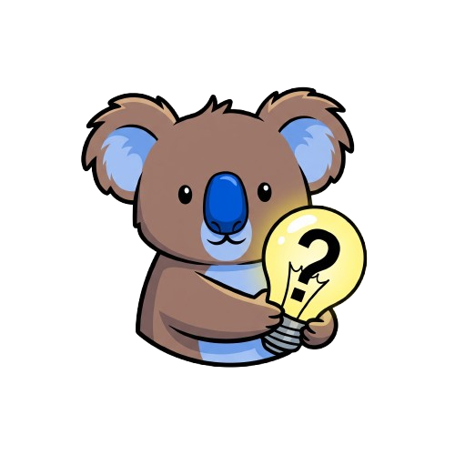

  

    

      

        

          <h1>Browse</h1>
          
Explore our collection of explanations by category or tag. Find the perfect explanation for your needs by navigating through our organized content structure.

        

        
      

    

    <!-- Categories Section -->
    

      <h2>Categories</h2>
      

        
        
          <a href="#{{ category | slugify }}" class="tag category-tag" data-category="{{ category | slugify }}">
            <i class="fas fa-folder"></i> {{ category }} 
            
          </a>
        
      

    

    
    <!-- Tags Section (initially hidden, shown when category is selected) -->
    

      <h2>Tags for </h2>
      

        <!-- Tags will be populated by JavaScript -->
      

      <button class="btn-primary back-button" id="back-to-categories"><i class="fas fa-arrow-left"></i> Back to Categories</button>
    

    
    <!-- Explanations Section (initially hidden, shown when tag is selected) -->
    

      <h2>Explanations tagged with </h2>
      
      <!-- Search Filter -->
      

        <input type="text" id="explanation-search" placeholder="Search in results..." class="search-input">
        <button id="clear-search" class="btn-secondary"><i class="fas fa-times"></i></button>
      

      
      

        <!-- Will be populated by JavaScript -->
      

      
No results found. Try a different search term.

      <button class="btn-primary back-button" id="back-to-tags"><i class="fas fa-arrow-left"></i> Back to Tags</button>
    

  

<!-- Data for JavaScript -->

